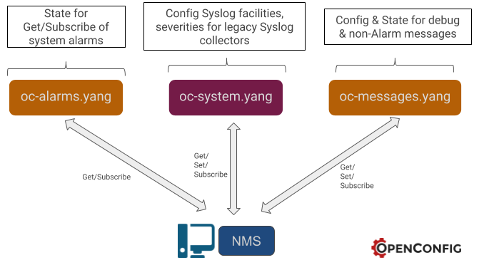

# Overview of the Messages Module

The messages module gives an operator the ability to obtain Syslog messages
over a telemetry channel, such as a gRPC stream, utilizing a
Publisher/Subscriber method. Some information that is currently
 reported in syslog messages does not easily lend itself to being
 modeled as operational state within the OpenConfig models, for
 example, free-form text trace or debugging messages.
The two high level goals of this
module are to:
-  Enable debugging operations performed today using OpenConfig-modeled data.
-  Reduce the number of management plane interfaces to a network device,
thus reducing requirements for client systems and simplifying testability.
This avoids having operators collect syslog messages alongside streaming
telemetry data when they need process-specific instrumentation to support
debugging.

# Where the Messages module fits


This module is part of the system management model. The Messages module does
not itself replace the necessity to configure which messages (eg Severity)
are sent to traditional Syslog collectors. That is still done utilizing the
/system/logging/remote-servers' path. This module will however allow for
configuration of which messages (eg Severity) are sent over the telemetry
interface to the Subscriber.

# Debugging

Due to the high variability of platform-specific debugging, the expectation
is that implementors (vendors) may augment this Messages module Base identity (eg
DEBUG_SERVICE) with more specific debug services.

# Annoted Messages Tree

```
+--rw system
 +--rw messages
    +--rw config
    # Config leaf for the Severity of the messages which are sent
    # over the telemetry interface.
    |  +--rw severity?   syslog-severity
    +--ro state
    |  +--ro severity?   syslog-severity
    # State leaf for the Syslog message payload (eg the String of data).
    # This is used for both debugging and non-debugging strings.
    |  +--ro messages?   string
    +--rw debug-entries
       +--rw debug-service* [service]
          +--rw service    -> ../config/service
          +--rw config
          # This is the Base identity for configuring a list of debugging
          # operations. For example "ip ospf hello".
          |  +--rw service?   identityref
          # Whether any configured debug services are enabled, and therefore
          # being sent to Subscribers.
          |  +--rw enabled?   boolean
          +--ro state
             +--ro service?   identityref
             +--ro enabled?   boolean
```
