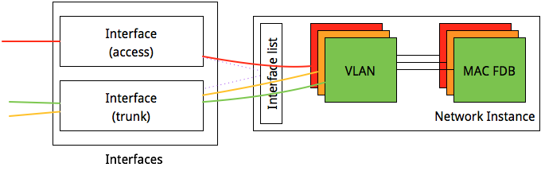
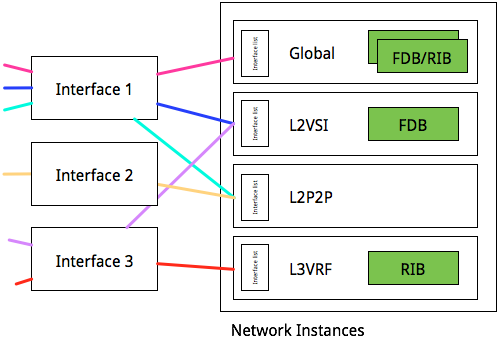

# OpenConfig Interfaces, Network Instance and VLANs

**Contributors:** Rob Shakir & OpenConfig WG members

There have been a number of questions from network device implementors as to how
they should expect that the OpenConfig interfaces and VLAN models should
interact with one another - especially in the context of the different types of
network element that they manufacture. This document seeks to provide some
clarification of the motivations for the OpenConfig structure, as well as
insight into the types of network element that the model seeks to cover.

## Use Cases and Motivating Principles
There exist three different network element types which typically exist in
today's networks:

*   **"Flat L2 switches"**- these devices typically have a single 4K VLAN
    space, provide only Ethernet switching capabilities, and no IP routing. They
    typically have limited ability to manipulate VLANs. They may support QinQ - and
    in this case may have the ability to switch on outer-tag, or the (outer,inner)
    tuple. As well as 'traditional' switches, this group of devices may include
    network elements such as OLTs which provide Ethernet-only switching for
    subscriber traffic.
*   **"PE routers"** - these devices typically act as IP/MPLS provider edge
    devices - where ports or interfaces can be terminated Layer 2 bridging
    domains (which may be local-only, or connected to other bridging domains through
    some form of backbone encapsulation - such as MPLS). In these devices, there is
    essentially the concept of a per-service VLAN space - and more complex VLAN
    operations may be performed (push, pop, swap etc.).
*   **"Hybrid switch router devices"** - these are network elements that combine
    both the ability to have switched VLANs within a global VLAN space, with the
    ability to terminate VLANs into a certain L2 or L3 forwarding table.
    Essentially, these devices tend to operate as a hybrid between the "PE router"
    device type and "Flat L2 switch" types defined here - with some
    implementation-specific complexities.

The OpenConfig model seeks to support all these types, with the following
particular considerations:

*   The management of a device which acts as a 'flat L2 switch' should continue
    to be operationally similar - that is to say, support a model where VLAN
    tags can be explicitly configured in a single namespace, and interfaces can be
    configured to interact with those VLANs - either as an 'access' port where a
    single VLAN exists, or a 'trunk' port where multiple VLANs should be carried
    over an interface.
*   Management of 'routed' devices should not involve interaction with the
    'switched' types of VLANs - that is to say, where VLAN encapsulation for a
    platform is specifically scoped to an individual interface, then this should not
    require any global configuration to be created.
*   Devices with multiple VLAN spaces, and per-instance VLAN spaces should be
    supported.
*   The OpenConfig model should not be overly prescriptive of the VLAN
    capabilities of an individual platform - particularly to ensure cases where
    platforms may differ in their ability to switch packets (e.g., on the inner VLAN
    when QinQ encapsulation is not lost).

## Relationship to the Network Instance Model

Network instance is the OpenConfig model that provides the ability to run
multiple forwarding or routing tables on a single network element. Instances can
be defined to be Layer 2 only, Layer 3 only or a combination of both. A special
type of network instance is defined (type DEFAULT), which is defined as the
'global' routing instance of the network device.

Currently, there is not a defined structure to the set of models, but it is
proposed that the VLAN model (currently /vlans) be rooted under an individual
network instance. This leads to a YANG tree similar to the one below.

```
               +--rw device* [hostname]
			     ...
                  +--rw ocif:interfaces
                  |  +--rw ocif:interface* [name]
			 	     ...
                  +--rw netinst:network-instances
                     +--rw netinst:network-instance [name]
                        +--rw netinst:interfaces
                        |  +--rw netinst:interface* [id]
				           ...
                        +--rw vlan:vlans
                           +--rw vlan:vlan* [vlan-id]
					           ...
```

In this case, a device has a global list of interfaces - corresponding to the
physical ports that exist on the device. This list is outside of the
network-instance model, since subinterfaces of these interfaces may correspond
to different network instances (e.g., a VLAN interconnect to an access network,
where multiple customer services exist on an individual interface).

An interface is then associated with a network-instance by virtue of the
reference type under 'netinst:interfaces'. Additionally, each network-instance
maintains its own list of VLANs - which are locally significant to that network
instance.

## Use Case: Flat Switch, VLAN-aware L2VPN, or Virtual Switch

If one pictures a flat Layer 2 switch with the following
*   An access interface -- where untagged frames should map to a 'red' VLAN.
*   A trunk interface -- which carries two VLANs - green and orange.

The diagram below shows how this is represented using the OpenConfig model.



This would be represented in the following data instance (see lines beginning
with # for annotations):

```
{
    # The global interface list is configured with two interfaces - which are
    # entire ports in this case. These interfaces have no subinterfaces, and
    # simply specify mappings to 802.1q tags on each interface.
    "interfaces": {
        "interface": {
            "g0/0/0": {
                "ethernet": {
                    "switched-vlan": {
                        "config": {
         				    # The 'access' interface is marked as such and
                        # the VLAN with which untagged frames are associated
                        # marked as ID 1042.
                            "interface-mode": "ACCESS",
                            "access-vlan": 1042
                        }
                    }
                },
                "config": {
                    "description": "ACCESS PORT",
                    "name": "g0/0/0"
                },
                "name": "g0/0/0"
            },
            "g1/0/42": {
                "ethernet": {
                    "switched-vlan": {
                        "config": {
   				              # The trunk interface is marked as such, and a list of
                            # the VLANs to be accepted on this trunk specified.
                            "trunk-vlans": [
                                2048,
                                2049
                            ],
                            "interface-mode": "TRUNK"
                        }
                    }
                },
                "config": {
                    "description": "TRUNK PORT",
                    "name": "g1/0/42"
                },
                "name": "g1/0/42"
            }
        }
    },
    "network-instances": {
        "network-instance": {
            # Despite the fact that the device is a flat switch, a single
            # "default" network instance is created, this has the type of
            # 'DEFAULT' - which is specified to mean the global instance in
            # the network-instance model.
            "DEFAULT": {
                "interfaces": {
                    "interface": {
                        # The interfaces configured globally are associated with
                        # this network instance, and hence the VLAN namespace
                         # inside it. The port, rather than a subinterface is
                         # specified here, as these are switched interfaces.
                        "g0/0/0": {
                            "config": {
                                "interface": "g0/0/0",
                                "id": "g0/0/0"
                            },
                            "id": "g0/0/0"
                        },
                        "g1/0/42": {
                            "config": {
                                "interface": "g1/0/42",
                                "id": "g1/0/42"
                            },
                            "id": "g1/0/42"
                        }
                    }
                },
                # Each VLAN which is used in the switch is configured within
                # the network instance.
                "vlans": {
                    "vlan": {
                        "2048": {
                            "vlan-id": 2048,
                            "config": {
                                "vlan-id": 2048,
                                "name": "GREEN"
                            }
                        },
                        "2049": {
                            "vlan-id": 2049,
                            "config": {
                                "vlan-id": 2049,
                                "name": "ORANGE"
                            }
                        },

                        "1042": {
                            "vlan-id": 1042,
                            "config": {
                                "vlan-id": 1042,
                                "name": "RED"
                            }
                        }
                    }
                },
                "config": {
                    "name": "DEFAULT",
                    "type": "DEFAULT"
                },
                "name": "DEFAULT"
            }
        }
    }
}
```

In this case, the configuration is similar to that which would be expected of a
basic L2 switch today. Since it is embedded in a network instance, there can
also be a multiplicity of such configurations - which allows L2 switches that
support multiple 'virtual switches' to simply duplicate network instances to
support each virtual switch, and L2VPN services which are VLAN-aware to utilise
the same approach if all ports are trunk-mode.

## Use Case: 'PE' device with routed subinterfaces and L2VPN

One of the major differences between PE devices and the flat L2 switch case that
is described above is the association of an individual interface with multiple
forwarding contexts - for example, one can imagine a device whereby:

*   One interface carries:
    *   A VLAN terminating into the global table, with IP configuration.
    *   A VLAN terminating into a Layer 2 switched virtual instance carrying
        multiple VLANs.
    *   A VLAN terminating into a PWE service.
*   A second interface carrying a single VLAN which terminates into the L2 PWE
    service.
*   A third interface carrying:
    *   A VLAN terminating into a L2VPN service carrying a single VLAN.
    *   A VLAN terminating into a L3VPN.

The representation of this mapping is shown in the diagram below.



This would be represented by the following JSON-serialised data instance:

```
{
    "config": {
        "hostname": "asr1k.lon-1a"
    },
    #
    # The global list of interfaces - in this case, subinterfaces
    # are used for all interfaces whether they are L2 or L3 config
    #
    "interfaces": {
        "interface": {
            "t0/12/116": {
                "config": {
                    "description": "PE Interface 0",
                    "name": "t0/12/116"
                },
                "name": "t0/12/116",
                "subinterfaces": {
                    "subinterface": {
                        "2048": {
                             #
                             # A subinterface specified to match on VLAN 2048
                             # on the parent "t0/1/2/116" interface
                             #
                            "index": 2048,
                            "vlan": {
                                "config": {
                                    "vlan-id": 2048
                                }
                            },
                            "config": {
                                "index": 2048,
                                "description": "red VLAN instance in L3VRF"
                            },

                            #
                            # Since this is a L3 interface, it has configuration
                            # for IPv4 and IPv6 that correspond to this subint.
                            #
                            "ipv4": {
                                "address": {
                                    "84.18.192.124": {
                                        "ip": "84.18.192.124",
                                        "config": {
                                            "ip": "84.18.192.124",
                                            "prefix-length": 24
                                        }
                                    }
                                }
                            },
                            "ipv6": {
                                "address": {
                                    "2001:4c20::1": {
                                        "ip": "2001:4c20::1",
                                        "config": {
                                            "ip": "2001:4c20::1",
                                            "prefix-length": 64
                                        }
                                    }
                                }
                            }
                        },

                        #

                        # The simple L2 interface on the same interface does not
                        # use any 'access' or 'trunk' VLAN configuration, but rather
                        # specifies the VLAN that it matches. Mapping to the
                        # network instance is done explicitly inside the network instance<
                        #
                        "1042": {
                            "index": 1042,
                            "vlan": {
                                "config": {
                                    "vlan-id": 1042
                                }
                            },
                            "config": {
                                "index": 1042,
                                "description": "purple VLAN instance in L2VSI"
                            }
                        }
                    }
                }
            },
            "g0/0/0": {
                "config": {
                    "description": "PE Interface 1",
                    "name": "g0/0/0"
                },
                "name": "g0/0/0",
                "subinterfaces": {
                    "subinterface": {
                        "1400": {
                            "index": 1400,
                            "vlan": {
                                "config": {
                                    "vlan-id": 1400
                                }
                            },
                            "config": {
                                "index": 1400,
                                "description": "blue VLAN instance in L2VSI"
                            }
                        },
                        "1042": {
                            "index": 1042,
                            "vlan": {
                                "config": {
                                    "vlan-id": 1042
                                }
                            },
                            "config": {
                                "index": 1042,
                                "description": "pink VLAN instance in GLOBAL"
                            },
                            "ipv4": {
                                "address": {
                                    "192.168.1.2": {
                                        "ip": "192.168.1.2",
                                        "config": {
                                            "ip": "192.168.1.2",
                                            "prefix-length": 24
                                        }
                                    }
                                }
                            },
                            "ipv6": {
                                "address": {
                                    "2001:db8::1": {
                                        "ip": "2001:db8::1",
                                        "config": {
                                            "ip": "2001:db8::1",
                                            "prefix-length": 64
                                        }
                                    }
                                }
                            }
                        },
                        #
                        # For the L2 P2P interface, mapping is done in exactly
                        # the same way that it is for the L2VSI service above,
                        # and again, this is on a subinterface with no config
                        # that relates to the access/trunk VLANs
                        #
                        "1500": {
                            "index": 1500,
                            "vlan": {
                                "config": {
                                    "vlan-id": 1500
                                }
                            },
                            "config": {
                                "index": 1500,
                                "description": "cyan VLAN instance in L2P2P"
                            }
                        }
                    }
                }
            },
            "g0/10/114": {
                "config": {
                    "description": "PE Interface 2",
                    "name": "g0/10/114"
                },
                "name": "g0/10/114",
                "subinterfaces": {
                    #
                    # This subinterface uses a QinQ match condition such that
                    # the frames that are accepted into it are double-tagged.
                    # NB: The L2 P2P service could be made to match all inner
                    # tags with a match condition on 1042.* - and can be specified
                    # with ranges, so that a subset of VLANs can be mapped into
                    # the L2 service.
                    #
                    # Some discussion may be merited as what this means for VLAN
                    # re-write within the service, at the moment, we assume that
                    # this is implicitly enabled based on the fact that there are
                    # different encapsulations at each end of the PWE3 service.
                    #
                    "subinterface": {
                        "10421042": {
                            "index": 10421042,
                            "vlan": {
                                "config": {
                                    "vlan-id": "1042.1042"
                                }
                            },
                            "config": {
                                "index": 10421042,
                                "description": "orange VLAN instance in L2P2P"
                            }
                        }
                    }
                }
            }
        }
    },
    "hostname": "asr1k.lon-1a",
    #
    # The set of network instances is then specified on the device.
    #
    #
    "network-instances": {
        "network-instance": {
            "L2VSI": {
                #
                # Each network instance has a list of associated interfaces,
                # the matches can be done based on interface (where there is
                # no specific match of encapsulation - as per the previous
                # example), or based on subinterface.
                #
                # The interface/subinterface leaves are separate to allow this
                # to be flexible, and a free-text ID is given to the user to
                # name this connection if req'd.
                #
                "interfaces": {
                    "interface": {
                        "g0/0/0.1400": {
                            "config": {
                                "interface": "g0/0/0",
                                "id": "g0/0/0.1400",
                                "subinterface": 1400
                            },
                            "id": "g0/0/0.1400"
                        },
                        "t0/12/116.1042": {
                            "config": {
                                "interface": "t0/12/116",
                                "id": "t0/12/116.1042",
                                "subinterface": 1042
                            },
                            "id": "t0/12/116.1042"
                        }
                    }
                },
                "config": {
                    "name": "L2VSI"
                },
                "name": "L2VSI"
            },
            "L3VRF": {
                "interfaces": {
                    "interface": {
                        "t0/12/116.2048": {
                            "config": {
                                "interface": "t0/12/116",
                                "id": "t0/12/116.2048",
                                "subinterface": 2048
                            },
                            "id": "t0/12/116.2048"
                        }
                    }
                },
                "config": {
                    "name": "L3VRF"
                },
                "name": "L3VRF"
            },
            "GLOBAL": {
                "interfaces": {
                    "interface": {
                        "g0/0/0.1042": {
                            "config": {
                                "interface": "g0/0/0",
                                "id": "g0/0/0.1042",
                                "subinterface": 1042
                            },
                            "id": "g0/0/0.1042"
                        }
                    }
                },
                "config": {
                    "name": "GLOBAL"
                },
                "name": "GLOBAL"
            },
            "L2P2P": {
                "interfaces": {
                    "interface": {
                        "g0/0/0.1500": {
                            "config": {
                                "interface": "g0/0/0",
                                "id": "g0/0/0.1500",
                                "subinterface": 1500
                            },
                            "id": "g0/0/0.1500"
                        },
                        "g0/10/114.1042.1042": {
                            "config": {
                                "interface": "g0/10/114",
                                "id": "g0/10/114.1042.1042",
                                "subinterface": "1042.1042"
                            },
                            "id": "g0/10/114.1042.1042"
                        }
                    }
                },
                "config": {
                    "name": "L2P2P"
                },
                "name": "L2P2P"
            }
        }
    }
}
```

It is notable that in this case, no use of the access-vlan or trunk-vlan leaves
is made. Essentially, it is possible to ignore these 'switched-vlan' leaves in
the case that an explicit network instance is required to forward traffic
between ports. This is typical of service provider PE edge devices.

If there is no case in which a device needs to match multiple VLANs that cannot
be specified with a single vlan encapsulation statement, then there is
essentially no need to support access-vlan and trunk-vlan on these platforms.
The operator does not lose any functionality. The vlan leaf is relatively
flexible, for example:

*   x.y can be used to match outer tag x, inner tag y.
*   x.* can be used to match all inner tags of outer tag x.
*   x..y.z can be used to match inner tag z with outer tags ranging from x to y.
*   x..y.a..b can be used to match out tags x to y with inner tags in the range a to b.
*   *.y can be used to match inner tag y with any outer tag.

Some of these options are obviously more flexible than particular hardware may
be able to implement, in this case, it is envisaged that the implementation
returns a NACK/NOK message to the client - rather than provide a deviation from
the model.

## Use case: Switch/Router Hybrid

In the case of a switch/router hybrid device ("brouter"? "swrouter"? "routitch?"
:-)) it is possible to have switched VLANs on an interface, which then has
accompanying subinterfaces that are routed into a particular network instance.

A device which has a trunk port switching VLAN IDs 1024-1030 within the global
network instance, and also routes VLAN 100 on the same interface into a private
L3 forwarding instance uses the following configuration:

```
{
    "config": {
        "hostname": "asr1k.lon-1a"
    },
    "interfaces": {
        "interface": {
            "g0/0/0": {
                #
                # The switched VLANs are configured directly on the interface
                # such that these packets are associated with the interface
                # which is associated with the top-level interface.
                #
                "ethernet": {
                    "switched-vlan": {
                        "config": {
                            "trunk-vlans": [
                                1024,
                                1025,
                                "1026..1030"
                            ],
                            "interface-mode": "TRUNK"
                        }
                    }
                },
                "config": {
                    "name": "g0/0/0"
                },
                "name": "g0/0/0",
                #
                # Subinterfaces are configured such that the encapsulation matches
                # VLANs that are not specified on the top-level interface. A config
                # which attempts to configure the same interface in multiple contexts
                # is an error.
                #
                "subinterfaces": {
                    "subinterface": {
                        "100": {
                            "index": 100,
                            "vlan": {
                                "config": {
                                    "vlan-id": 100
                                }
                            },
                            "config": {
                                "index": 100
                            },
                            "ipv6": {
                                "address": {
                                    "2001:DB8::12": {
                                        "ip": "2001:DB8::12",
                                        "config": {
                                            "ip": "2001:DB8::12",
                                            "prefix-length": 127
                                        }
                                    }
                                }
                            }
                        }
                    }
                }
            }
        }
    },
    "hostname": "asr1k.lon-1a",
    "network-instances": {
        "network-instance": {
            #
            # The default network instance is configured - the
            # type is DEFAULT-INSTANCE in the top level configuration.
            #
            "GLOBAL": {
                "interfaces": {
                    "interface": {
                        #
                        # The entire interface is then associated with the
                        # instance to pick up the 'switched' VLANs on that interface
                        #
                        "g0/0/0": {
                            "config": {
                                "interface": "g0/0/0",
                                "id": "g0/0/0"
                            },
                            "id": "g0/0/0"
                        }
                    }
                },
                #
                # By configuring VLANs within the network instance, the FDB for each
                # VLAN within the default instance is created.
                #
                "vlans": {
                    "vlan": {
                        "1024": {
                            "vlan-id": 1024,
                            "config": {
                                "vlan-id": 1024,
                                "name": "vlan1024"
                            }
                        },
                        "1025": {
                            "vlan-id": 1025,
                            "config": {
                                "vlan-id": 1025,
                                "name": "vlan1025"
                            }
                        },
                        "1026": {
                            "vlan-id": 1026,
                            "config": {
                                "vlan-id": 1026,
                                "name": "vlan1026"
                            }
                        },
                        "1027": {
                            "vlan-id": 1027,
                            "config": {
                                "vlan-id": 1027,
                                "name": "vlan1027"
                            }
                        },
                        "1028": {
                            "vlan-id": 1028,
                            "config": {
                                "vlan-id": 1028,
                                "name": "vlan1028"
                            }
                        },
                        "1029": {
                            "vlan-id": 1029,
                            "config": {
                                "vlan-id": 1029,
                                "name": "vlan1029"
                            }
                        }
                    }
                },
                "config": {
                    "type": "nit:DEFAULT-INSTANCE",
                    "name": "GLOBAL"
                },
                "name": "GLOBAL"
            },
            #
            # If the subinterface is to be associated with a non-default instance
            # this association is configured within that instance.
            #
            "SOME_VPN": {
                "interfaces": {
                    "interface": {
                        "SALT-LAKE-CITY-OFFICE": {
                            "config": {
                                "interface": "g0/0/0",
                                "id": "SALT-LAKE-CITY-OFFICE",
                                "subinterface": 100
                            },
                            "id": "SALT-LAKE-CITY-OFFICE"
                        }
                    }
                },
                "config": {
                    "type": "L3VRF",
                    "name": "SOME_VPN"
                },
                "name": "SOME_VPN"
            }
        }
    }
}
```

Since there remain a class of devices which fall within this category of
configuration, supporting them within the model is seen to be a useful
endeavour. If a device corresponds to only one of these configuration models (it
is either just a switch, or a 'router'/'PE' device) then this hybrid
configuration is unlikely to be required.

## References/Unannotated JSON

*   OpenConfig interfaces - https://github.com/openconfig/public/tree/master/release/models/interfaces
*   OpenConfig network-instance - https://github.com/openconfig/public/tree/master/release/models/network-instance
*   OpenConfig VLANs - https://github.com/openconfig/public/tree/master/release/models/vlan
*   OpenConfig NI overview slides - https://datatracker.ietf.org/meeting/94/materials/slides-94-rtgwg-9
*   Hybrid router/switch RFC7951 JSON -
    https://github.com/openconfig/public/tree/master/doc/examples/netinst_router_sw.json
*   PE device JSON -
    https://github.com/openconfig/public/tree/master/doc/examples/netinst_pe_device.json
*   Switch device JSON -
    https://github.com/openconfig/public/tree/master/doc/examples/netinst_sw.json
