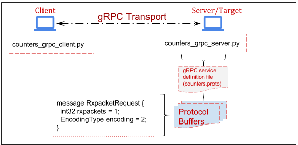
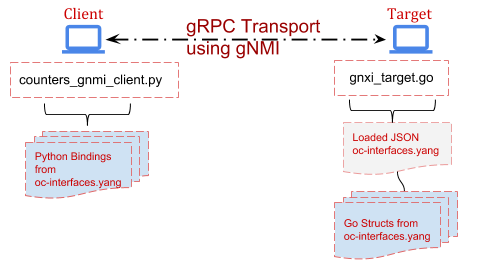
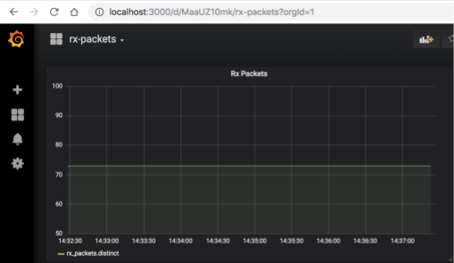
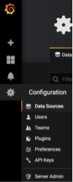
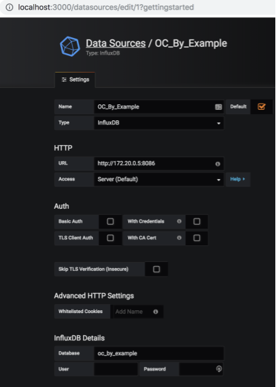
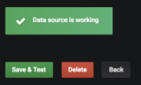
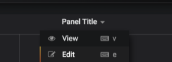
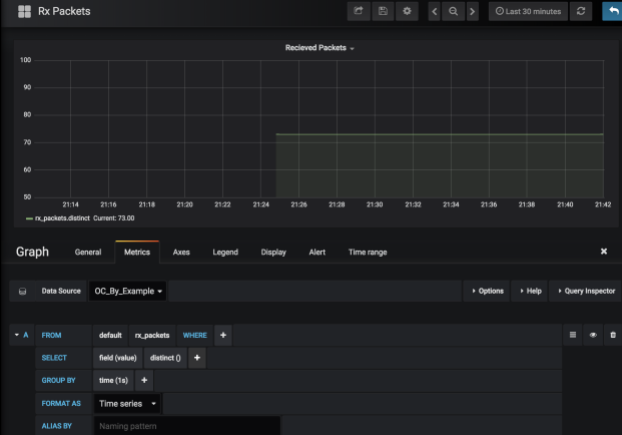

# OpenConfig By Example
Author: Mike Albano
Date: June 4, 2019

1. **Subject(s):** YANG Modeling, gRPC, Protocol Buffers, gNMI, Streaming
Telemetry (Pub/Sub), TSDB Visualizations.

2. **Objective:** Introduction to above concepts. Go from zero to fully
functioning systems, through lessons which build on each other. These are
introductory, to show the reader the core concepts utilized in OpenConfig
and gNMI. The goal here is not to build production-ready systems, rather provide
examples of usage and concepts so the reader can connect the dots.

3. **Prerequisite:** Docker. These lessons utilize Docker containers, therefor it
must be installed on your host system. Docker is free and can be installed on
OSX, Linux, Windows (See:
  [https://docs.docker.com/install/#supported-platforms](https://docs.docker.com/install/#supported-platforms)).

Tip: Follow the very limited "Hello World" example in the Docker Getting Started
to ensure it’s working as intended on your host machine (eg docker run
hello-world). See the appropriate section for your host OS, for example:
[https://docs.docker.com/docker-for-mac/](https://docs.docker.com/docker-for-mac/).

Limited coding experience optional.

# Document Flow
Each lesson will begin with an expected end result. This is a sneak peak at the
lessons final output. Following that, each lesson will have a Set Up section to
prevent having to depart from the core of the lesson (Exercises) for
house-keeping. There will also be an Appendix and Further Reading sections
relevant to each lesson.

# Table of contents
1. [Lesson 1: gRPC & Protocol Buffers](#Lesson1)
2. [Lesson 2: Streaming RPC’s](#Lesson2)
3. [Lesson 3: YANG Models & Language Bindings](#Lesson3)
4. [Lesson 4: gNMI. Get and SetRequests](#Lesson4)
5. [Lesson 5: Storing & Visualizing Telemetry](#Lesson5)

## Lesson 1: gRPC & Protocol Buffers <a name="Lesson1"></a>

### Objective
Demonstrate the basics of creating a client and server which use gRPC to
communicate. It's likely that within your network management system's
implementation you'll implement clients (e.g. a streaming telemetry or
configuration push client), and servers (e.g., a endpoint that can be queried
for config). The gRPC concepts are therefore foundational for wider
development.

### Expected End Result
```
root@grpc_client:/home/user# python counters_grpc_client.py
message: "Rx packets for eth0: 26"
```
Note, your Rx packets number will differ.

### Set Up

The Topology for the following lessons is as follows:



#### 1. Set up our virtualized network.
This allows us to utilize static IPs. Tip: Many docker commands may need to be
**prepended with sudo** if using Linux. On a terminal in your host machine:
```
docker network create --subnet=172.20.0.0/24 ocnet
```
#### 2. Run the Client and Server containers for use in this lesson.
In one terminal on your host machine, run:
```
docker run -it --net ocnet -h grpc_server --ip 172.20.0.2 openconfig/grpc_server:v1 /bin/bash
```
And in a **different terminal** on your host machine, run:
```
docker run -it --net ocnet -h grpc_client --ip 172.20.0.3 openconfig/grpc_client:v1 /bin/bash
```
### Exercise

#### 1. Write the [protocol buffer](https://developers.google.com/protocol-buffers/).

This is a language and platform neutral definition for structured data, which in
our case is a packet counter taken from the output of ‘ifconfig’. There are two
interfaces on the server, Loopback and eth0. Therefore, we define a message of
type ‘String’ which we will used to determine which interface we are interested
in performing ‘ifconfig’ on. For example:
```
message RxpacketRequest {
  string interface = 1;
}
```
Next, we need to define a message for the Rx packets taken from ifconfig. Since
this is a counter, represented as a positive number, this will be of type
‘uint64’. A full description of types can be found [here](https://developers.google.com/protocol-buffers/docs/proto#scalar).
For example:
```
message RxpacketReply {
  uint64 rxpackets = 1;
  string message = 2;
}
```
Why the "string message = 2"? This will be explained later in the lesson.

The full .proto file can be found in your /home/user directory in the Client
container. You should have the Client container open in a terminal window, so
you can peek at the file with:
```
root@grpc_client:/home/user# cat counters.proto
```
There is more metadata in the counters.proto file. For a full understanding of
all these fields, you’re encouraged to see **Further Reading** section at the
end of this lesson.

Tip: If you accidentally closed one of your running Containers (Client or
  Server) you can simply restart it with the above "docker run…" commands. If
  desired, you can also leave a container running, and attach a second console
  (in a new terminal window) by doing:
```
docker exec -it <container_id> /bin/bash
```
You obtain the container_id from the ‘docker ps’ command on your host.
For example:
```
$ docker ps
CONTAINER ID        IMAGE               COMMAND             CREATED                          
3162670c9d94        grpc_client         "bash"              3 seconds ago</td>
```
#### 2. Compile source code from our counters.proto.
With our .proto now defined, we will run the protocol buffer compiler. In our
case we’ll be using the Python language, though remember proto’s are language
(and platform) independent, so you could swap portions of these lessons with any
of the [supported languages.](https://developers.google.com/protocol-buffers/)
This will generate Python Classes which will be utilized by both our Client and
Server applications. Ordinarily, you would need to [install the protobuf compiler](https://developers.google.com/protocol-buffers/docs/downloads.html), however that’s been
taken care of for you within the Client and Server containers. Generate the
source code by running the ‘protoc’ compiler, for example:
```
root@grpc_client:/home/user# python -m grpc_tools.protoc -I./ --python_out=. --grpc_python_out=. ./counters.proto
```
You’ll notice that the current directory now contains some new files, such as
‘counters_pb2.py’. These are the Python functions and classes we will use in
both our Client and Server applications. You can poke around in counters_pb2.py
and should recognize the names of some of them (they will resemble the
  ‘messages’ from counters.proto), but understanding all the contents of that
  file is out-of-scope, and unnecessary.

#### 3. Write our client application

First, we write a small script which imports the previously generated protobuf
code, along with some other mandatory libraries. The focus here is on simplicity
, not the Python code, however it may help to walk through the more important
bits. If you prefer to skip ahead, simply peak at
/home/user/counters_grpc_client.py.
```
channel = grpc.insecure_channel(172.20.0.2:50051')
```
As the variable name implies, this establishes an insecure gRPC channel to our
Server (172.20.0.2) on port 50051.
```
stub = counters_pb2.int_counterStub(channel)
```
Here we utilize the imported protobuf code, counters_pb2, which references the
service int_counter (line 5 of counters.proto) and creates a ‘Stub’. This stub
is just a local object in Python. Refer back to the counters.proto file for
reference.
```
response = stub.GetCounter(counters_pb2.RxpacketRequest(interface=server_int))
```
Here we utilize the ‘GetCounter’ RPC, from the counters.proto, and specify the
interface we’re interested in getting Rx packets for. Note, this interface is
passed into the ‘GetRxPackets’ function. For example, if you wanted to get Rx
packets for the Loopback interface, you would simply change line 24 to "lo".
For example:
```
response = GetRxPackets('eth0') →  response = GetRxPackets('lo')
```
You could alternatively utilize the Python interactive interpreter to achieve
the same results. For example:
```
grpc_client$ python
>>> import grpc
>>> import counters_pb2
>>> import counters_pb2_grpc
>>> channel = grpc.insecure_channel('172.20.0.2:50051')
>>> stub = counters_pb2_grpc.int_counterStub(channel)
>>> response = stub.GetCounter(counters_pb2.RxpacketRequest(interface='eth0'))
>>> print(response)
```
**If you run this**, either through the interpreter or with "$ python
counters_grpc_client.py", **it will fail**. That’s expected, since we have not
set up the Server yet. Let’s do that!

#### 4. Set up the gRPC server.
Over in your other terminal window (where you started the grpc_server
  container), the counters_pb2.py & counters_pb2_grpc.py files already exist.
  What we’ll be doing is essentially the reverse of the Client app, which means
  we’ll import the protobuffer code here as well. We’ll also need to write a
  small function to run ‘ifconfig’ and parse the output to get what we’re
  interested in, which in this case is Rx packets on an interface.

Again, if you’d prefer to skip the explanation of the code, feel free to peek at
counters_grpc_server.py. I’ll highlight the important bits here.
```
input = os.popen('ifconfig ' + request.interface)
```
Here we’re assigning the output of the entire ifconfig command to a variable
named ‘input’. The request message from the client written in Step 3 includes
the interface we’re interested in. Remember the "string interface" in the proto?
In other words, this enumerates to “ifconfig eth0”.

Next, we utilize simple list comprehension to loop over the ifconfig output and
assign the integer to our variable, rxcounter.
```
rxcounter = int(''.join([x.split()[2] for x in input if 'RX packets' in x]))
```
For example, ‘rxcounter’ would equal "31" in the following output:
```
root@grpc_server:/home/user# ifconfig
eth0: flags=4163<UP,BROADCAST,RUNNING,MULTICAST>  mtu 1500
  inet 172.20.0.2  netmask 255.255.255.0  broadcast 172.20.0.255
  ether 02:42:ac:14:00:02  txqueuelen 0  (Ethernet)
  RX packets 31  bytes 3099 (3.0 KiB)
  RX errors 0  dropped 0  overruns 0  frame 0
  TX packets 14  bytes 1554 (1.5 KiB)
  TX errors 0  dropped 0 overruns 0  carrier 0  collisions 0
```
Now we’ll see why we assigned that string in the counters.proto file earlier.
Refer back to counters.proto (string message = 2;):
```
16     return counters_pb2.RxpacketReply(
17     message='Rx packets for %s: %i' % (request.interface, rxcounter))
```
When we respond to the Client app over the RPC, we do so by returning two fields
(See ‘RxpacketReply’ in counters.proto). One is simply a string of our choosing
("Rx packets for…"), the other an integer (the rxcounter). Responding with this
concatenation of a string and an integer here is more for example, and won’t
show up in later lessons when we get into YANG models and dealing with real
Network Elements.

#### 5. Put it together.
With some understanding of what the Client and Server are doing, let’s run the
Server by executing "python counters_grpc_server.py" on the “grpc_server”
container. For example:
```
root@grpc_server:/home/user# python counters_grpc_server.py
gRPC server listening on port 50051
```
Let’s run the Client by executing "python counters_grpc_client.py" on the
“grpc_client” container. For example:
```
root@grpc_client:/home/user# python counters_grpc_client.py
```
You should see the following output on the client:
```
message: "Rx packets for eth0: 32"
```
That’s it! You are now getting "Telemetry" over a gRPC connection between a
Client and a Server. In further lessons you’ll learn about data modeling and
the gNMI specification. For now all you need to understand is that gRPC
connections such as this here are what’s occurring at the lower level.

Extra credit; change the Rx packet value to a string, and see what happens.
**Why does it fai?**

Leave these containers running for Lesson 2.

Extra credit answer:

It should fail, as the proto strictly specifies the type as a ‘uint64’.
Therefore, if you change the server app (counters_grpc_server.py) to assign the
Rx packets as a string, you’d see something like this on the Client:
```
grpc._channel._Rendezvous: <_Rendezvous of RPC that terminated with:
status = StatusCode.UNKNOWN
details = "Exception calling application: %d format: a number is required, not str"
debug_error_string = "{"created":"@1537377279.885271400","description":"Error received from peer","file":"src/core/lib/surface/call.cc","file_line":1099,"grpc_message":"Exception calling application: %d format: a number is required, not str","grpc_status":2}"
```
Later, you’ll see similar Schematic errors when we utilize YANG models and gNMI.

### Lesson 1 Appendix

#### Docker Run…

This instantiates a Docker Container from a local Image. If the local Image is
not found, it will be downloaded from Docker Hub. We are also specifying the use
of the created subnet and the static IP for this container to utilize. Finally,
we attach to a local shell within this container. In this case, you should see
output similar to the following:
```
Container not found locally downloading now
```
#### Further Reading
If you find yourself copy/pasting from these examples, without grasping the core
concepts, you are encouraged to read through the following:

* Protocol Buffer [language guide](https://developers.google.com/protocol-buffers/docs/proto3).

* [gRPC FAQ](https://grpc.io/faq/)

* [gRPC Hello World](https://grpc.io/docs/quickstart/python.html)

## Lesson 2: Streaming RPCs <a name="Lesson2"></a>

### Expected End Result
```
root@grpc_client:/home/user# python counters_grpc_client.py
message: "Rx packets for eth0: 26"
message: "Rx packets for eth0: 27"
message: "Rx packets for eth0: 28"
...
```
Note, your Rx packets number will differ.

### Set Up

This is a short lesson, simply to show how a Streaming RPC works. Same topology
and containers in use as Lesson 1.

### Objective
Demonstrate how we leverage the paradigm of choosing when to push at the server
side as a concept. For context, see [this presentation](https://pc.nanog.org/static/published/meetings/NANOG73/1677/20180625_Shakir_Snmp_Is_Dead_v1.pdf) for how this
differs from what you may be used to with protocols such as SNMP. If it was not
obvious, in Streaming Telemetry, we utilize streaming RPCs.
### Exercise
Streaming Telemetry, where a Publisher/Subscriber mechanism is used, is a big
part of [OpenConfig](http://www.openconfig.net/projects/telemetry/). It changes
the construct from a constant ‘Polling’ of Network Elements to one where a
collection system (eg NMS) simply Subscribes to messages, reducing system
overhead while increasing the granularity of Telemetry. Below we’ll show a very
basic example of this.

#### 1. Change the proto
A slight modification to the proto file is all that’s needed. We simply add the
word "stream" to the rpc definition. For example:
```
rpc GetCounter(RxpacketRequest) returns (stream RxpacketReply) {}
```
Note, the "streaming" proto is already present in the Client container;
“/home/user/counters-stream.proto”. Don’t forget to generate new source code
from this proto file with:
```
root@grpc_client$ python -m grpc_tools.protoc -I./ --python_out=. --grpc_python_out=. ./counters-stream.proto
```
Again, this has already been done for you on the Server, so no need to generate
source code there. Fundamentally, what is occurring here is the Server will no
longer respond once and close thee gRPC channel. Instead the channel will
remain open, until either side closes it, allowing the Server to respond
multiple times. This also explains why you'll see the "for" loops later in the
client code. As you can imagine, this drastically improves the efficiency of
obtaining Telemetry, when compared to a constant polling from Client to Server.

#### 2. Change the Client
Here we’ll be slightly modifying the Client app, to utilize the new proto source
code, and introducing a loop to repeatedly print the Server response. The Python
code is not the focus here, so you can simply look at
"/home/user/counters_grpc_streamclient.py". The below lines are what’s changed.
```
*snip*
for r in response:
  print(r)
*snip*
```
#### 3. Change the Server
Similar to the Client app, we’ll now use the new proto source and introduce a
loop which will obtain the Rx packets in the interface every second. See the
While loop in "/home/user/counters_grpc_streamserver.py" on the grpc_server
container.

#### 4. Run the Server, then the Client.
Do this in a manner similar to the previous lesson. For example, on the
grpc_server container:
```
root@grpc_server:/home/user# python counters_grpc_streamserver.py
    gRPC server listening on port 50051
```
And over on the grpc_client container:
```
root@grpc_client:/home/user# python counters_grpc_streamclient.py
message: "Rx packets for eth0: 54"
message: "Rx packets for eth0: 55"
message: "Rx packets for eth0: 58"
...
```
The difference should be obvious, in that the RPC is now ‘streaming’ the results
of the ifconfig output back to the client. You’ve just used a Streaming RPC!

**You can stop** these two containers now.

## Lesson 3: YANG Models & Language Bindings <a name="Lesson3"></a>

### Expected End Result
```
root@gnmi_client:/home/user# python interfaces_generator.py
{
  "openconfig-interfaces:config": {
    "enabled": true
  }
}
```
### Set Up
While we could re-use our previous containers, to eliminate confusion between
lessons, we’ll start fresh. If you have not done so already, you can exit the
terminals/containers used in the previous lesson.

Run the gNMI Client for use in this lesson. In a terminal on your host machine,
run:
```
docker run -it --net ocnet -h gnmi_client --ip 172.20.0.3 --add-host www.example.com:172.20.0.4 openconfig/gnmi_client:v1 /bin/bash
```
### Exercise
As you’ll see in the coming lessons, an operator need not worry about writing
protos or configuring gRPC when utilizing OpenConfig and gNMI. In fact, the gNMI
Target (which is the Server) is going to be a Network Element, such as an Access
Point, Router, Switch etc. Here we’ll be writing a YANG model to define the
format of the Telemetry, which again in our case is Rx packets of an interface.

OpenConfig utilizes YANG models. From [OpenConfig.net](openconfig.net): *"Our
initial focus in OpenConfig is on compiling a consistent set of vendor-neutral
data models (written in YANG) based on actual operational needs from use cases
and requirements from multiple network operators."*

You can think of YANG models as somewhat analogous to proto’s, in that they
define how data is supposed to look, giving it structure. YANG is a data
modeling language, and like proto’s, they are language-neutral. OpenConfig aims
to define these YANG models in a vendor-neutral way.

#### 1. Write our first YANG Model

Similar to the previous lesson, this won’t be an all inclusive "how to write
YANG models" rather an introduction through example.

With that, we start the model with some meta, such as YANG version, namespace,
prefix, etc. The interesting bit is the ‘packet-counter’ container. In YANG a
container is an interior node in the Schema; which is to say, it doesn’t have a
value, like a "leaf" node does. For example, in the following, “packet-counter”
is the container and “rx-packets” is the leaf node.
```
container packet-counter {
  description
    "Container to hold packet counters.";
  leaf rx-packets {
    type uint32;
    description
      "Received packets on the interface.";
  }
}
```
Again, notice the ‘type’ here as an unsigned 32bit integer.

The full YANG model is viewable at "/home/user/interfaces.yang". This brief
model is enough to generate language bindings from, and use in our code, however
we’re going to make this model adhere to the OpenConfig Style first...

#### 2. Make our YANG Model adhere to [OpenConfig Style](https://github.com/openconfig/public/blob/master/doc/openconfig_style_guide.md)

This is really about structure of the YANG containers, groups, leaf nodes etc.
We’re also going to add a leaf node for "enabled". Specifically this is:
```
leaf enabled {
  type boolean;
  description
    "This leaf enabled and disabled the interface.";
}
```
This boolean type Config leaf can be used for setting an interface to enabled
(True) or disabled (False).

If you reference the complete model ("/home/user/openconfig-interface.yang")
there are a couple things worth mentioning here.

* Config and State are differentiated within groupings and containers, but are
within the same model. There are a number of reasons for this, but for now, just
know that an operator (that’s you) may want to obtain both the State of a
configuration on the device, and the ‘actual’ State of the device. These can be
distinctly different (eg. just because you told a device to disable an interface
  does not necessarily mean it did so).

* Every Config leaf has a corresponding State leaf, however the reverse is not
true. In our example, rx-counters is a State leaf only. After all, you wouldn’t
configure the received packets on an interface.

* The series of groupings and containers allows for maximum re-use. You’ll see
examples of this throughout OpenConfig models, where one Model may import
another model. In fact, our interfaces model here imports
[openconfig-extensions](https://github.com/openconfig/public/blob/master/release/models/openconfig-extensions.yang) (also present in your /home/user directory).

For much more verbose examples, you’re encouraged to peek at the public models.
For example, the real version of the OpenConfig interfaces model: [openconfig-interfaces.yang](https://github.com/openconfig/public/blob/master/release/models/interfaces/openconfig-interfaces.yang).

#### 3. Verify our YANG model does not contain errors.

This is commonly referred to as [linting](https://en.wikipedia.org/wiki/Lint
  (software). For this we utilize [pyang](https://github.com/mbj4668/pyang)
  (with the [OpenConfig plugin](https://github.com/openconfig/oc-pyang)). This
  is already on your system, so give it a shot with (all one command):
```
root@gnmi_client:/home/user# pyang --plugindir ./oc-pyang/openconfig_pyang/plugins/openconfig.py openconfig-interface.yang --strict --lint -p ./

oc-interfaces.yang:26: error: unterminated statement definition for keyword "description", looking at r
```
There’s an error in the model at line 26. **Fix the model** and run pyang again.

**The Fix**: Add a trailing ";" at the end of the revision description line (25).

With the model now passing lint, there are a number of handy options in pyang.
For example, you can view the Model as an ASCII tree on your terminal by adding
the flag "-f tree" to the command above. The output would be:
```
module: openconfig-interface
+--rw interfaces
 +--rw config
   |  +--rw enabled?   boolean
   +--ro state
      +--ro enabled?      boolean
      +--ro rx-packets?   uint32
```
Here it becomes more obvious what we meant before by "every config leaf has a
state leaf, but not vice-versa". ‘rx-packets’ is ONLY within the state
container, while ‘enabled’ is present in both. Note, you can also use
“-f jstree” or “-f docs” to generate HTML output for viewing the model in a
browser.
See [here](http://www.openconfig.net/docs/models-html/) for example.

#### 4. Generate language bindings

Now that we have our YANG model, let’s try to use it. YANG is language-neutral,
so which tool you utilize to generate your bindings really depends on the
language you’re writing your Client with. For example, we’ll be using the Open
Source library [PyangBind](https://github.com/robshakir/pyangbind), since we’re
utilizing Python in this lesson, however [YGOT](https://github.com/openconfig/ygot)
exists for those using Go. Functionally they do similar things, which is
generate code from YANG models, which we can then use in our programs. If this
sounds abstract, it should clear up by the end of this lesson. This should feel
functionally similar to what we did earlier with proto’s. Except now, instead of
taking a proto and generating source (using protoc compiler), we’re taking a
YANG model and generating source (using PyangBind).

Since PyangBind is already installed for you, simple run the following command
to generate our Python source.
```
root@gnmi_client:/home/user# pyang --plugindir $PYBINDPLUGIN -f pybind -o interface_bindings.py openconfig-interface.yang
```
Paraphrasing from the [README](https://github.com/robshakir/pyangbind/blob/master/README.md):

* $PYBINDPLUGIN is the location of the PyangBind plugin.

* interface_bindings.py is the desired output file.

* openconfig-interface.yang is the path to the YANG module that bindings are to be generated for.

You’ll now notice a new file in your /home/user directory,
"interface_bindings.py". If you poke around in there, you’ll recognize some of
the classes and function names, but just like before, it’s not important to
understand this file. We’ll just be importing it into our Client, like before.

#### 5. Use the language bindings

Here we’ll be writing a small script which simply imports our language bindings
(interface_bindings.py) and prints some JSON to our terminal. The full script is
in /home/user/interface_generator.py. Here are the interesting bits:
```
configs = openconfig_interface()
def CreateConfigs():
  int_conf = configs.interfaces
  int_conf.config.enabled = True
```
Here we are assigning the imported bindings to a variable named ‘configs’.
We use
that inside the CreateConfigs function by assigning the ‘interfaces’ Class to
the variable "int_conf" (recall the “container interfaces” in the YANG model we
  wrote earlier). We can now manipulate this configs object, by setting config
  leaf’s. In this example we’re setting the interface enabled boolean to “True”.
  This would result in the Target (Network Element) enabling the interface.
```
print(pybindJSON.dumps(all_configs, indent=2))
```
Here we are simply using PyangBinds function to ‘[serialize](https://github.com/robshakir/pyangbind#serialising)’ the configs object as JSON, and print that to
stdout.

Note, this is an oversimplified contrived example, as in the reality the YANG
model would be much more verbose, containing lists [of interfaces], types, etc.,
as would the Client software and resulting JSON payload, but the core concepts
are the same.

Run the script. You should see the following:
```
root@gnmi_client:/home/user# python interface_generator.py
{
  "config": {
    "enabled": true
  }
}
```
So we’ve now gone from a YANG model [to an OpenConfig YANG model] to generating
language bindings from that YANG model, to using those bindings in a small
script, which prints our OpenConfig conforming JSON. The JSON is exactly what
would end up getting sent to the gNMI Target (eg the AP, Router, Switch) to
enable an interface.

Similar to before, you can purposefully break this by utilizing the incorrect
‘type’ in the script. For example, "enabled" is of type ‘boolean’. What happens
if you change that to a string? It should (and does) break, as that violates the
Schema we’ve defined in the YANG model.

In the next lesson, we will do the reverse of this. We will deserialize, or
rather, take JSON and load it into a class object (called ‘configs’ in our
  example) while ensuring it adheres to the language bindings (again, generated
    from the YANG model).
    See [here](https://github.com/robshakir/pyangbind#deserialising). Note, this
    is precisely what occurs when we collect or Get Telemetry from
    network elements. This ensures the vendor is strictly adhering to the
    defined Schema in the YANG model.

You should leave the gnmi_client container running for the next lesson.

## Further Reading

* [RFC7590](https://tools.ietf.org/html/rfc7950) - The YANG 1.1 Data Modeling
Language

* [www.openconfig.net](www.openconfig.net)

* [https://github.com/openconfig/public](https://github.com/openconfig/public)

* [PyangBind](https://github.com/robshakir/pyangbind)

* [OpenConfig YANG Style Guide](https://github.com/openconfig/public/blob/master/doc/openconfig_style_guide.md)

### Lesson 3 Appendix

#### Dump as RFC7951-formatted JSON

If you’d like to dump the JSON as RFC7951-formatted JSON, simply add a ‘mode=ietf’ to dumps. For
example:
```
print(pybindJSON.dumps(all_configs, indent=2, mode='ietf'))
```
### Why The --add-host?

In this lesson, we run the client with the --add-host parameter so that it can
resolve "[www.example.com](http://www.example.com)" to our sample gNMI Target
(172.20.0.4). You can see this in the /etc/hosts file of the container.

## Lesson 4: gNMI. Get and SetRequests <a name="Lesson4"></a>

### Expected End Result
```
root@gnmi_client:/home/user# python simple_client.py
notification {
  timestamp: 1537939439031070110
  update {
    path {
      elem {
        name: "interfaces"
      }
      elem {
        name: "state"
      }
      elem {
        name: "rx-packets"
      }
    }
    val {
      uint_val: 73
    }
  }
}    
```
### Set Up
The Topology for the following lessons is as follows:



Grab the gnxi_target container for use in this lesson.

In your host machine, run:
```
docker run -it --net ocnet -h gnxi_target --ip 172.20.0.4 openconfig/gnxi_target:v1
```
Note, we left off the ‘/bin/bash’ so you should see something similar to the
following in your terminal:
```
1 gnmi_target.go:119] starting to listen on :10161
1 gnmi_target.go:125] starting to serve
```
Our emulated Target has loaded a JSON payload in memory, which includes a
key/value for the state leaf for "rx-packets". Leave it running for the duration
of this lesson.

You already have the gnmi_client container from the last lesson, and we’ll be
expanding on that in this lesson. If you closed it, you can restart the
container with:
```
docker run -it --net ocnet -h gnmi_client --ip 172.20.0.3 --add-host www.example.com:172.20.0.4 openconfig/gnmi_client:v1 /bin/bash
```
### Exercise
We’ll be continuing to utilize the gnmi_client container from the previous
lesson. You also set up a new container to act as a gNMI Target. The Target in
this case will be a container
running [gnxi_target](https://github.com/google/gnxi); a reference
implementation written in Go. Ordinarily, this would be a network element
(AP/Router/Switch etc.), however this reference implementation helps us emulate
that. This also highlights the **language and platform neutrality** of YANG,
gNMI, gRPC and OpenConfig.

Note, the gnxi_target has been pre-loaded with proper bindings, referred to as
Structs in the Go language (these are loosely analogous to Classes in Python,
  generated with PyangBind), so let’s jump in to setting up the gNMI Client app.

#### 1. Create the gNMI Source Files

Just like we did back in Lesson 1, we’re going to generate the source code by
running the ‘protoc’ compiler. This time however, we’ll point to the [gNMI proto](https://github.com/openconfig/gnmi/tree/master/proto/gnmi), instead of the proto we
created in Lesson 1. The [gNMI repo](https://github.com/openconfig/gnmi), with
necessary proto files is already in your /home/user directory, so you can simply
run the following from /home/user on your gnmi_client container:
```
root@gnmi_client:/home/user# python -m grpc.tools.protoc --proto_path=/home/user/gnmi/proto/gnmi_ext/ --proto_path=/home/user/gnmi/proto/gnmi/ --python_out=./client_app --grpc_python_out=./client_app /home/user/gnmi/proto/gnmi/gnmi.proto
```
You should now see additional files in /home/user/client_app
(gnmi_pb2.py & gnmi_pb2_grpc.py). Just like in Lesson 1, these are the
source-code files which we’ve generated from the .proto. These files will be
imported into our Client app in the following exercise.

#### 2. Set up the Client & Issue GetRequests

As before, you can peek at the final code for this portion of the lesson
in/home/user/simple_client.py. We will go over the interesting bits here:
```
import gnmi_pb2
import gnmi_pb2_grpc
import grpc
```
Firstly, we are importing our protoc-generated code from the previous step. With
our gNMI source imported, we set up the gNMI channel (which semantically is
  actually a gRPC channel):
```
channel = grpc.secure_channel('www.example.com:10161', creds)
```
This should look very familiar to Lesson 1 - Step 3. The added creds variable in
use here is due to our sample gNMI Target’s usage of a ‘secure’ channel, using
certificates for both encryption AND authentication. We specify the certificate
files to use in the line directly previous to this one.

We then define the gRPC stub and move on to formulate the gNMI GetRequest (in a
  function called … GetRequest):
```
stub = gnmi_pb2_grpc.gNMIStub(channel)
```
Again, this should look very familiar as we did the same thing in Lesson 1.

Now we’ll begin to formulate some gNMI calls.
```
gnmi_response = GetRequest(stub, 'interfaces')
```
Here we’re assigning a variable to what we will ultimately ‘Get’ from the gNMI
Target (our other container running gnxi_target). "interfaces" in this context
represents the  [string-formatted gNMI path](https://github.com/openconfig/reference/blob/master/rpc/gnmi/gnmi-path-conventions.md), which should look familiar, as it’s the first YANG container --
Line 55 of openconfig-interface.yang.. Since we want our gNMI Target in this
lesson to be more representative of a real Network Element, we also added some
State leaf’s from the YANG model into the JSON. Here is the full JSON loaded
into the gNMI Target:
```
{
  "interfaces": {
    "config": {
      "enabled": true
    },
    "state": {
      "enabled": true,
      "rx-packets": 73
    }
  }
}
```
This JSON is in "/home/user/interface.json" on the gNMI Target container. In the
GetRequest function we see the following gNMI specific helpers:
```
path_list = [gnmi_pb2.PathElem(name=path, key={})]
paths = gnmi_pb2.Path(elem=path_list)
response = stub.Get(gnmi_pb2.GetRequest(path=[paths]), metadata=[
    ('username', 'foo'), ('password', 'bar')])
```
The first line utilizes the imported proto-generated code to formulate an array
(Python List) of gNMI Path’s we will supply in our [gNMI GetRequest](https://github.com/openconfig/reference/blob/master/rpc/gnmi/gnmi-specification.md#331-the-getrequest-message). In this case, the ‘path’ in
‘name=path’ is passed in to this function; which is literally ‘interfaces’. The
second line is constructing our paths into Path Elements. See [gnmi path conventions](https://github.com/openconfig/reference/blob/master/rpc/gnmi/gnmi-path-conventions.md#constructing-paths) for more info here.
[Path encoding](https://github.com/openconfig/reference/blob/master/rpc/gnmi/gnmi-path-conventions.md#schema-path-encoding-conventions-for-gnmi) is critical to gNMI;
and exactly what is occurring here will become more clear in the exercises
following this one. Something we won’t be utilizing in our simple example, is
the "key={}", or rather we’ll be leaving that empty. This is used when we have a
leaf-list in our YANG model, in order to reference an instance within the list.
For example, if we had a ‘list’ of interfaces, key’d by the interface name, you
would utilize something like “key={eth1}”. See [here](https://github.com/openconfig/reference/blob/master/rpc/gnmi/gnmi-specification.md#222-paths) for more info.

The third line is actually initiating the GetRequest. This includes some
required metadata, like username/password which our gNMI Target is expecting for
authentication.

Give it a shot. Run the simple_client.py.
```
root@gnmi_client:/home/user# python simple_client.py
notification {
  timestamp: 1537927476628149440
  update {
    path {
      elem {
        name: "interfaces"
      }
    }
    val {
      json_val: "{\"config\":{\"enabled\":true},\"state\":{\"enabled\":true,\"rx-packets\":73}}"
    }
  }
}
```
You just initiated a gNMI GetRequest, received a [GetResponse](https://github.com/openconfig/reference/blob/master/rpc/gnmi/gnmi-path-conventions.md), and printed that response to the terminal
(stdout). The above is the protobuffer response. You can probably recognize the
‘json_val’ content. Later, we’ll turn this into JSON and Serialize it according
to the same YANG model we used to generate the JSON.

#### 3 Convert the protobuf response to JSON

To make the GetResponse a bit easier to read, let’s turn it into JSON (and print
  it). We’re also going to index into the protobuf response, since we’re only
  after what’s contained in the ‘json_val’ in the above protobuf response.

Add the following lines to the bottom of simple_client.py:
```
js_response = json.loads(gnmi_response.notification[0].update[0].val.json_val)
print(json.dumps(js_response, indent=2))
```
Note, you should also comment out the previous print statement;
"print(gnmi_response)". This will make the output contain only JSON, using the
built-in Python JSON library. For example, your output should now resemble this:
```
{
  "state": {
    "rx-packets": 73,
    "enabled": true
  },
  "config": {
    "enabled": true
  }
}   
```
You should experiment with changing the ‘print(gnmi_response)’ line of code. For
example, how would you print out only the timestamp of the GetResponse message?

#### 4. Utilize gNMI Paths
Here we’ll be modifying simple_client.py to provide a gNMI Path in our
GetRequest. As mentioned previously, gNMI Paths are a big part of the protocol
and an operator would often want to limit the GetRequest to something more
granular than ‘/’ (eg everything from the root of the OpenConfig Tree).

The appropriate way to do this would be through a helper function, accepting
paths as an argument to the script, but we’ll do it the easy way here just to
show an example. We’re going to create a list of paths, and pass that to the
GetRequest function.

For example, replace the current ‘path_list’ variable with the following:
```
path_list = [gnmi_pb2.PathElem(name='interfaces', key={}),
gnmi_pb2.PathElem(name='state', key={}),
gnmi_pb2.PathElem(name='rx-packets', key={})]
```
Now, instead of using a single path of "interfaces", we’re supplying a list of
gNMI PathElements. If you look at the response you’ll now see the value of our
GetResponse is limited to simply  ‘rx-packets’...or 73. If you’ve done it
correctly, your output should resemble:
```
root@gnmi_client:/home/user# python simple_client.py
notification {
  timestamp: 1537939439031070110
  update {
    path {
      elem {
        name: "interfaces"
      }
      elem {
        name: "state"
      }
      elem {
        name: "rx-packets"
      }
    }
    val {
      uint_val: 73
    }
  }
}
```
Note, if you did not comment out/delete the previous lines where you loaded the
Response as JSON (js_response) the script will fail, as the current GetResponse
is now returning a uint_val (not a json_val). How could you change this, if you
did want to print **only** the current GetResponse value of 73? ([answer](#heading=h.v4ribf7r2p8b))

#### 5. Deserialize the Response
We already have our Python language bindings from the previous lesson, but now
we’re going to utilize them to ensure the response we get from the gNMI Target
is adhering to our YANG model. A real-world example of this might be for an
operator to ensure what they have configured previously on a network element, is
actually still configured. This process of taking the response JSON and placing
it back ‘in to’ our language bindings from Lesson 3 is referred to as
‘deserializing’ (See [here](https://github.com/robshakir/pyangbind#deserialising-a-data-instance-)).
To do this, we can basically combine our two sample scripts
(simple_client.py & interface_generator.py). You can peak at the final version
of this in /home/user/notso_simple_client.py.

Basically, the interesting bits are in these lines:
```
path_list = [gnmi_pb2.PathElem(name='interfaces', key={}),
             gnmi_pb2.PathElem(name='config', key={})]

js_response = json.loads(gnmi_response.notification[0].update[0].val.json_val)
pybindJSONDecoder.load_json(js_response, None, None, obj=configs.interfaces.config)
```
The first two lines show we’re doing a gNMI GetRequest while specifying the path
of "/interfaces/config". Accordingly the gNMI GetResponse contains only the JSON
value of that portion of the tree. Specifically, this is:
```
{
  "enabled": true
}
```
"js_response" is loading the gNMI response as JSON. Finally, we use PyangBind's
[pybindJSONDecoder](https://github.com/robshakir/pyangbind#deserialising-a-data-instance-)
to load the above JSON into our configs object. Again, this enforces strict
adherence to the YANG model we created back in Lesson 3.

Similar to what we did in Lesson 3, you can print the contents of this configs
object (which now contains the response from the gNMI Target) as JSON with:
```
print(pybindJSON.dumps(configs, indent=2))
```
This would yield:
```
{
  "interfaces": {
    "config": {
      "enabled": true
    }
  }
}
```
So to recap what we’ve done here:

We’ve created source-code from the gNMI Protocol Buffer file (available on
  GitHub). We’ve used that source-code in our Python script to issue some gNMI
  GetRequest messages against our sample gNMI Target. We then used gNMI Paths to
  issue another GetRequest, and converted the GetResponse to JSON, loading it
  into our generated language bindings from [Lesson 3](#heading=h.ss311ii4btos).

Worth noting, many of these steps would fail/throw an error if any of the
attributes (either Key or Value) did not strictly adhere to the YANG model we
created back in Lesson 1. This is important, as that YANG model defines the
Schema, and it MUST be adhered to by any Network Element (gNMI Target) we deal
with. In OpenConfig the YANG models are the source-of-truth so to speak. This
allows us to write tooling without fear of vendor APIs returning differing
structured data (or no structure at all).

Leave both containers running for the next lesson.

### Further Reading

* [gNMI Specification](https://github.com/openconfig/reference/blob/master/rpc/gnmi/gnmi-specification.md)

* [gNMI Path Conventions](https://github.com/openconfig/reference/blob/master/rpc/gnmi/gnmi-path-conventions.md)

### Lesson 4 Appendix

* You can generate your own GoStructs, using the [YGOT library](https://github.com/openconfig/ygot.git).
An example usage, as was done for our gnmi_target Container above would be:
```
go run ./ygot/generator/generator.go -path=./ -output_file=./generated.go -package_name=gostruct -generate_fakeroot -fakeroot_name=device -compress_paths=false openconfig-interface.yang
```
* You can also utilize the gnmi_client, written in Go. It’s present in the
gnmi_target container. An example usage would be:

    go run /go/src/github.com/google/gnxi/gnmi_get/gnmi_get.go -xpath "/" -target_addr 172.20.0.4:10161 -target_name www.example.com -key ./client.key -cert ./client.crt -ca ./ca.crt -username foo -password bar -alsologtostderr

* Tooling & versions used in this lesson:
```
python -m pip install --no-binary=protobuf -I grpcio-tools==1.15.0
```
Print only the value of rx-packets, when supplying gNMI paths:
```
print(gnmi_response.notification[0].update[0].val.uint_val)
```
## Lesson 5: Storing & Visualizing Telemetry <a name="Lesson5"></a>

### Expected End Result



### Set Up

The Topology for the following lessons is the same as the previous one.

Open a terminal and run InfluxDB in it’s own container.
```
docker run -it --net ocnet --ip 172.20.0.5 openconfig/influxdb:v1
```
Note, this container was built using [InfluxDB container.](https://hub.docker.com/_/influxdb/)

Leave that container open for informational messages and open another terminal
to run Grafana in it’s own container:
```
docker run -dp 3000:3000 --net ocnet --ip 172.20.0.6 openconfig/grafana:v1
```
Note, this container was built using [grafana container.](https://hub.docker.com/r/grafana/grafana/)
This container will run in daemon mode, so you won’t see any messages on the
terminal after running. You can view the running containers with "docker ps".

### Exercise
This is out-of-scope from gNMI, OpenConfig, YANG, gRPC etc. however may help to
serve as an example of "how does all this stuff tie together?". Let's try to
show that with a simple Time Series Database (TSDB) and some visualizations.

We’re going to utilize an Open Source TSDB,
[InfluxDB](https://www.influxdata.com/) and [Grafana](https://grafana.com/), in
this lesson though obviously each operator will utilize whichever systems they
want.

#### 1. Populate The Database
Here we’re going to add our ‘rx-packets’ as a metric. We’ll be using the
containers and scripts we set up in earlier lessons. Over on your gnmi_client
container, we’re going to use the InfluxDB [Python client library](https://github.com/influxdata/influxdb-python).
So let’s add a couple lines to our "notso_simple_client.py" script, within the
main function. For example:
```
if __name__ == '__main__':  
  client = InfluxDBClient('172.20.0.5', 8086, 'root', 'root', 'oc_by_example')
  client.create_database('oc_by_example')
```
Now we’re ready to start populating data, which is done using
"client.write_points(<data_points>)". So let’s add that into our script, and put
it in a loop so we continually add the rx-packets value, every 5 seconds.
Replace our ‘path_list’ variable, and add the following:
```
path_list = [gnmi_pb2.PathElem(name='interfaces', key={}),
            gnmi_pb2.PathElem(name='state', key={}),
            gnmi_pb2.PathElem(name='rx-packets', key={})]
while True:
  gnmi_response = GetRequest(stub, path_list)
  rx_packets = gnmi_response.notification[0].update[0].val.uint_val
  print('Adding rx-packets %s to TSDB' % rx_packets)    
  client.write_points([{"measurement": "rx_packets", "fields": { "value":
                     rx_packets}}])
  time.sleep(5)
```
You should recognize most of this. We’ve experimented in previous lessons with
dealing with the gNMI GetResponse, changing paths etc.. The only new line here
is the ‘client.write_points…’, which as the name implies sends the result of our
Gets to our TSDB. When you run this, it should show the following in your
terminal:
```
root@gnmi_client:/home/user# python notso_simple_client.py
Adding rx-packets 73 to TSDB
Adding rx-packets 73 to TSDB
...
```
Leave that script running, as it will continually add data points to the TSDB
using the InfluxDB HTTP API.

#### 1. InfluxDB & Grafana
First, lets set up Grafana, and point it to our TSDB data source. Browse to
[http://localhost:3000](http://localhost:3000). Default user/pass is
admin/admin. Click Configure-->Data Sources, Add New Data Source:



The options are mostly self explanatory, but here are the highlights:


```
Type: InfluxDB
Name: OC_By_Example
URL: http://172.20.0.5:8086 (this is our Container running InfluxDB)
Database: oc_by_example
```
Click Save & Test, and you should see "Data source is working":



#### 2. Graph It!
Lets graph the Telemetry we are consuming, eg the rx-packets. Click Dashboards→
Add New Dashboard. Again, the selections here are self explanatory, but for this
lesson we’ll be using a dashboard type of ‘Graph’.

Click ‘Panel Title’-->Edit:



Change your Data Source to what you named it in Step 1 (OC_By_Example), and
click the ‘Select Measurement’ field. It should pre-populate with our metrics
that are being inserted by our script, eg ‘rx_packets’:



You should see the graph beginning to populate itself with the results. That’s
it!

### Lesson 5 Appendix

#### Why rx-packets don’t change in our graph

Recall that we’re emulating a gNMI Target. This emulated target has an
‘in-memory’ version of the our openconfig-interface.yang model. It’s not
actually parsing the output of ifconfig, as we were doing in Lesson 1 & 2. If we
were using a real/non-emulated Target, something like rx-bytes would obviously
change over time.

#### Useful links

* [InfluxDB Python Client](https://github.com/influxdata/influxdb-python)

# Conclusion

Obviously almost all the tools, concepts and descriptions here are introductory.
Hopefully this was enough to draw some conclusions about the advantage of
vendor/language/tool-chain neutrality and freedom of choice in all aspects. You
are encouraged to learn more by checking each lessons Further Reading section,
breaking things and checking out Openconfig
at [openconfig.net](http://openconfig.net) and [github/openconfig](https://github.com/openconfig/public)
