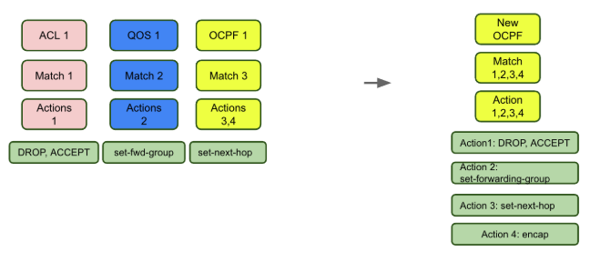
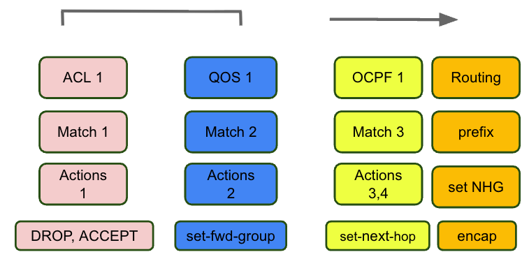
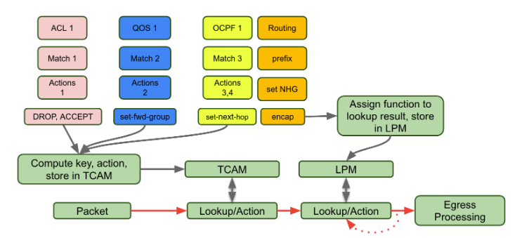
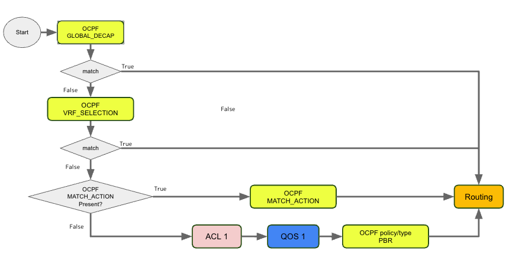

OpenConfig policy-forwarding match/action
=============

Authors:
 Darren Loher

Reviewers:
 Veerender Attri Sachendra Shetty Tianheng Chen Lakshmana Varahabhotla Masood Shah Rob Shakir

Date: Created Sep 18, 2025

# 1. Summary

There are operational use cases to create packet “match / action”  policies which can match on L2, L3, and L4 packet fields and execute actions like next-hop selection, encapsulation/decapsulation, egress forwarding class/queue assignment, and packet field manipulation.

Currently, OpenConfig data models for performing these actions are split into ACL, QoS, and OC Policy-Forwarding (OCPF) trees, each with unique match and action paths and slightly different schemas.
Instead of writing 3 groups of rules, we can express them all in one policy:



This document proposes extending the OCPF schema with rules and actions and a new OCPF policy type which allows more flexible rules and actions and provides references to existing vendor implementations.  This provides benefits of simplified rule expression, reducing the number of matches to be configured and providing more readable policies.

[insert drawing here]

Further, it allows porting existing policies written in vendor configuration to OpenConfig with minimal rewrites and a feasible pathway for vendors to develop support for a common model.

# 2. Background

Existing OpenConfig (OC) models for Access Control Lists (ACL), Quality of Service (QoS), and OpenConfig Policy-Forwarding (OCPF) all define match-action rules, with actions grouped by type. ACL rules primarily involve drop and accept actions. OC QoS focuses on classifying packets and setting specific fields, which must be combined with scheduling, policing, and queuing definitions. OCPF introduces a third schema for packet matching, with expected actions including next-hop setting, encapsulation, and decapsulation.

Modern hardware and Network Operating Systems (NOS) offer greater flexibility in defining match-action rules, extending beyond the categories currently defined by OC (ACL, OCPF, and QoS). Examples include JunOS's filter-based forwarding, Arista EOS's traffic policy features and Cisco IOS XR ACL based forwarding.

This proposal defines an order of operations which allow match action rules to coexist with OC’s traditional ACL, QoS classifiers, policing, queuing, TCAM-based match and forward rules, and LPM-based match and forward rules.

# 3. OC Model Design

This design expands the policy-forwarding tree with more rules and actions and a new policy type, MATCH_ACTION_POLICY.

If we apply an OCPF policy with actions to accept/drop and set forwarding-group to an interface, it would be wise to not define any ACL or QoS policy to that same interface to prevent ambiguity.  To ensure there is no ambiguity regarding mixing of ACL, QOS and OCPF MATCH-ACTION on a single interface, the   /policy-forwarding/policies/policy/config/type  MATCH_ACTION_POLICY is introduced.  When set, the implementation should reject configuration of other OCPF types, ACL or QOS classifier on a given interface.

## 3.1. policy-forwarding tree additions

The following tree summarizes the leaves to be added to the model.  This fake
rendering will be replaced with a real rendering of the yang tree.

```diff
  +--rw network-instances
     +--rw network-instance*[name]
        +--rw policy-forwarding
        |  +--rw policies
        |  |  +--rw policy* [policy-id]
        |  |     +--rw config
+                     +--rw type?    # Add enum MATCH_ACTION
        |  |     +--rw rules
        |  |        +--rw rule* [sequence-id]
+                      +--rw type?              -> oc-pf:rule-type # identity ref, similar to /acl/type
+                      +--rw name?              string  # user defined name for a rule
                       +--rw l2?
+                      +--rw mpls-traffic-class?     oc-mplst:mpls-tc
                       +--rw ipv4
                          +--rw source-address?
                          +--rw destination-address?
                          +--rw source-address-prefix-set?
                          +--rw destination-address-prefix-set?
+                         +--rw dscp?                oc-inet:dscp
                          +--rw dscp-set?
                          +--rw hop-limit?
                          +--rw fragment-offset?
+                         +--rw options?             oc-inet:options
+                         +--rw precedence?          oc-inet:precedence
                          +--rw protocol?
                       +--rw ipv6
                          +--rw hop-limit?
                          +--rw destination-address?
                          +--rw destination-address-prefix-set?  # exclude use case public#1314
                          +--rw fragment-offset?
                          +--rw protocol?
                          +--rw source-address?
                          +--rw source-address-prefix-set?
                       +--rw action
                          +--rw config
+                            +--rw count?              string  #user defined counter
!                            x--rw discard?  # deprecate in favor of forwarding-action
                             +--rw decapsulate-gre?                   boolean
                             +--rw decapsulate-gue?                   boolean
                             +--rw decapsulate-mpls-in-udp?           boolean
                             +--rw decap-network-instance?
                             +--rw decap-fallback-network-instance?
+                            +--rw dscp?                 oc-inet:dscp
                             x--rw encapsulate-gre      # (deprecated in favor of next-hop-group)
+                            +--rw forwarding-action?    # enum (DROP,ACCEPT,REJECT)
+                            +--rw forwarding-group?     ->  qos/forwarding-group
+                            +--rw log?                  boolean
+                            +--rw mpls-traffic-class?   oc-mplst:mpls-tc
                             +--rw network-instance?
                             +--rw next-hop?
                             +--rw next-hop-group?
+                            +--rw next-rule?            boolean  # see chaining
                             +--rw path-selection-group?
                             +--rw post-decap-network-instance?
+                            +--rw sample?               boolean # packet should be sampled
+                            +--rw ip-ttl?               uint8   # see openconfig/public#1313
```

## 3.2. User defined counters tree

In order to support the `action/config/count` leaf, a new top level
user-counters subtree is introduced.

```diff
+    +--rw user-counters
+    |  +--rw user-counter* [name]
+    |  |  +--rw config
+    |        +--rw name?           string
+    |  |  +--rw state
+    |  |     +--rw name?           string
+    |  |     +--rw counters
+    |  |        +--rw count?       oc-yang:counter64
```

# 4. Multiple Rules and Actions

OC does not explicitly state what logic is used when an OCPF policy has multiple rules, multiple criteria within a rule and if there are multiple actions on a rule.  OC is not clear on what should happen after an OCPF rule is matched or not matched.  The following text is proposed to be added to the OCPF model to describe how to handle multiple rules and actions.

Multiple match criteria in a single rule is treated logically as “AND”.

Multiple rules in a policy should be treated logically as “OR”.

Each rule must have one or more actions.

When a packet matches a rule, all actions associated with a rule are performed.

When a rule is matched, processing stops, unless the `next-rule` leaf is populated.

# 5. Order of operations and mapping match/action rules into device implementations

## 5.1. OC defined order of operations

Today OC defines the following order of operations between ACL, QOS and OCPF.  “Routing” is included as the step expected to follow policy forwarding.  Note that In today’s OC model, the sequence of ACL and QOS is ambiguous; OCPF is defined to happen after ACL and QOS.



In practice, implementations using ASICs for their packet processing compile their “match action rule” (ACL, QoS classifier,  policy forwarding, PBR, firewall, traffic policy, etc…) configurations into banks of TCAM memories.   The rules are compiled as bitfield masks which extract key data from packets.  The keys are looked up in TCAM memory to map to an action.    The TCAM memories are often rather limited in scale and the implementation details of the hardware and programming vary widely between ASICs and NOSs.

Abstractly the programming of these rules can be organized as follows:



This diagram is an example to provide context for this design and not a specification of OpenConfig.  Note that match rules on destination prefixes with actions related to egress/next-hop could be implemented in LPM, even if they are not traditional “routing”.  This could allow LPM tables may be used as a more scalable solution as compared to TCAM.  (or LEM in the case of say, MPLS or host routes).  Whether or not this is done is implementation specific.

## 5.2. OC order of operations with MATCH-ACTION

When considering all OCPF policy types, the resulting order of operations is:



## 5.3. Multiple actions in OCPF

OCPF rule processing stops when there is a match.  To execute multiple actions for a given match, write a single rule with two actions:

```json
        "policy-forwarding": {
          "policies": {
            "policy": [
              {
                "config": {
                  "policy-id": "Set Next Hop"
                },
                "policy-id": "Set Next Hop",
                "rules": {
                  "rule": [
                    {
                      "action": {
                        "config": {
                          "next-hop-group": "NHGroup1",
                          "forwarding-group": "FG_AF3"
                        }
                      },
                      "config": {
                        "sequence-id": 1
                      },
                      "ipv4": {
                        "config": {
                          "destination-address": "0.0.0.0/0"
                        }
                      },
                      "sequence-id": 1
                    }
                  ]
                }
              }
            ]
          }
        },
```

## 5.4. Chaining OCPF Rules

Use cases exist to chain multiple rules.  An OCPF leaf action/config/next-rule is defined to support rule chaining.   If action/config/next-rule is true, processing continues to the next rule.  If not true, then rule processing stops.  It is observed that chaining rules could have a performance impact on some implementations which may also depend on the depth of the chain.

Rule chaining is supported by Juniper `next-term` and Arista EOS `goto next` action.

# 6. Use cases

Below is a survey of use cases where match and action criteria can be written today using Juniper filter based forwarding and/or Arista traffic policy.  These use cases include fields that are not supported in OC today and/or implement expressions which mix what OC defines across ACL, QoS and OCPF.

## 6.1. Summary of use cases

A quick enumeration of the operational use cases is:

Match by src and/or dst ip, count, sample and drop
Match by ip fragment and ip protocol icmp, tcp, udp. Action: drop
Match from “configured bgp neighbors” , Action: count, ratelimit, set qos, accept
Match icmp to “locally configured interfaces”, Action: count, set qos, accept
Match ttl=1, Action: count, police, set next-hop-group
Match all src ip except some prefixes, and list of dest prefixes. Action: count, encap, queue, sample
Match a prefix list, set-dscp, update a user defined counter and set the next-hop

Using today’s OC equivalent for these policy terms would require writing
A series of ACL’s
With new actions for count and sample
With new match criteria to allow “except” prefixes
And a series of QoS policies restating the match criteria to set the queuing and policing
And a series of policy-forwarding policies restating the match criteria for terms which use encapsulation

## 6.2. set-dscp

Arista EOS traffic policies

```none
traffic-policies
  traffic-policy bg_nh2sr05percount
    match v6-dscp3 ipv6
         dscp 3
         !
         actions
            count
            redirect next-hop group v6_bg_nh2sr05
```

JunOS filter based forwarding

```none
      match odjirnhbkkb7u6xkxmr4d73x ipv4
         source prefix field-set src-qt5lp3gjtic3desxmcynrwgu
         destination prefix field-set dst-qt5lp3gjtic3desxmcynrwgu
         actions
            count ip-af3-queue
            set dscp 24
            set traffic class 3
            redirect next-hop group ingress-vip
         !
```

Cisco ABF

```none
ipv4 access-list ABF_EXAMPLE
 10 permit ipv4 192.168.10.0 0.0.0.255 any set-dscp 24 nexthop ipv4 10.0.0.254 # set-dscp not supported today
 20 permit ipv4 any any
!
```

## 6.3. Accept, Reject and Continue for policy-forwarding rules processing

This global-edge-filter policy shows examples of Juniper filter forwarding rules where policy-forwarding rules (Juniper terms) are chained using a “next term;” statement.  Currently OC policy-forwarding does not define what should happen when a rule matches in a chain of rules.  See the “Chaining OCPF Rules” section for a proposal for how to meet this use case.

## 6.4. Match IP TTL

The operational use case related to matching TTL  is when a customer packet arrives with a TTL=1 which the operator wishes to encapsulate and send to a distant host for processing.

The generalized solution for this is that OCPF rules matching packet fields on ingress should be processed before TTL decrement.  See relevant PR for adding a TTL match rule at [openconfig/public#1313](https://github.com/openconfig/public/pull/1313).

# 7. Appendix - Example Vendor configuration references

## 7.1. Arista EOS

### 7.1.1. Arista EOS decap with QoS

```none
!
ip decap-group pf-mpls-in-udp-decap-range
   tunnel type udp
   tunnel decap-ip 10.1.157.160
   tunnel overlay mpls qos map mpls-traffic-class to traffic-class
!
```

### 7.1.2. Arista EOS traffic-policy and QoS

Use case to apply traffic policy on the aggregate sub-interface and QoS (classification) on the aggregate interface.

```none
interface Port-Channel5
   description MyConnection
   mtu 9066
   no switchport
   no mpls ip
   service-policy type qos input INGRESS_POLICY_AF4
!
interface Port-Channel5.1100
   traffic-policy input mytp_1
   description MyConection_to_customer
   encapsulation dot1q vlan 1100
   ip address 169.254.44.187/29
  !
   traffic-policy mytp_1
      match mytp_1-rule1 ipv4
         destination prefix 169.254.44.187/32
         protocol icmp type echo-reply code all
      !
      match mytp_1-rule2 ipv4
         destination prefix 169.254.44.186/32 192.168.1.1/32
         !
         actions
            redirect next-hop group my_nexthop1
      !
      match pbr_myrule ipv4
         ttl 1
         !
         actions
            redirect next-hop group my_nexthop2 ttl 1
      !
      match ipv4-all-default ipv4
         actions
            redirect next-hop group my_nexthop3
      !
      match ipv6-all-default ipv6
   !
```

Using the recommended OC solution,  this should be configured with QoS on the aggregate interface and OCPF for the subinterface.

## 7.2. JunOS

### 7.2.1. JunOS filter based forwarding

```none
            term abc123 {
                from {
                    source-address {
                        0.0.0.0/0;
                        10.1.1.0/24 except;
                    }
                    destination-address {
                        192.0.2.128/25
                    }
                }
                then {
                    count my-af3-queue-counter;
                    forwarding-class af3;
                    encapsulate to-my-vip;
                    sample;
                }
            }
```

JunOS with locally configured BGP neighbors and actions for policer, counter and qos

```none
           term myterm2 {
                from {
                    source-prefix-list {
                        configured-neighbors-only;
                    }
                    source-port 1024-65535;
                    destination-port 179;
                    protocol tcp;
                }
                then {
                    count ip-af4-queue;
                    policer rate-limit-to-router;
                    forwarding-class af4;
                    accept;
                }
            }
```

## 7.3. Appendix - Vendor Config References

* [Juniper JunOS - Filter-Based Forwarding Overview](https://www.juniper.net/documentation/us/en/software/junos/routing-policy/topics/concept/firewall-filter-option-filter-based-forwarding-overview.html)
* [Cisco IOS XR - ACL Based Forwarding (ABF)](https://www.cisco.com/c/en/us/td/docs/iosxr/cisco8000/ip-addresses/25xx/configuration/guide/b-ip-addresses-cg-8k-25xx/implementing-access-lists.html#concept_cqm_tpf_kmb)
* [Cisco IOSXR - Policy Based Routing](https://www.cisco.com/c/en/us/td/docs/iosxr/cisco8000/routing/24xx/configuration/guide/b-routing-cg-cisco8000-24xx/m-policy-based-routing.html)
* [Arista EOS - Traffic Policy](https://www.arista.com/en/support/toi/eos-4-24-2f/14550-support-for-traffic-policy-on-interfaces)
* [Nokia SR Linux - policy-forwarding](https://documentation.nokia.com/srlinux/24-10/books/pdf/ACL_and_Policy-based_Routing_Guide_24.10.pdf).
