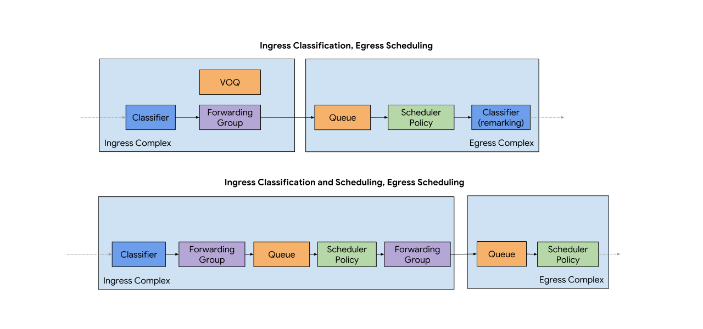

# Overview of OpenConfig QoS

Contributors: aashaikh†, robjs†, dloher†
† @google.com  
September 2024

# Overview of the QoS Model

## Schema of the QoS Model

The schema of the QoS model can be visualized with this diagram which
highlights the relationships between the objects in the model.


The OpenConfig quality of service model is made up of two sets of definitions:

-  Primitives that describe elements of QoS policy: includes definitions of
   **classifiers**, **forwarding-groups**, **queues** and
   **scheduler-policies**. Each of these elements is described in more detail
   below. These definitions can be thought of as blueprints that determine a
   set of behaviours.
-  Mapping to **interfaces**, which covers the instantiation of the blueprint
   definitions onto an interface. Each interface has configuration associating
   it with a set of blueprints, as well as operational state parameters that
   correspond to each of the instantiated elements (e.g., schedulers, or
   queues). This is located under `/qos/interfaces`.

## Flow of data through the QoS Model

The flow of packets through of the QoS model is shown in the diagram below.



When a packet arrives at an interface it is initially classified according to
the classifier that is described under
`/qos/interfaces/interface/input/classifier`. A `classifier` consists of a set
of `term` entries, that match on the specified `conditions`. The `actions` that
are applied for each classification rule results in assignment to a
`forwarding-group`, along with an optional `remark` action. A `forwarding-group`
is internal to the device, used for internal (in this case, cross-fabric)
scheduling. At the egress interface, a set of `queue` entries are instantiated
based on a `scheduler-policy`, which defines the set of scheduling actions that
are to be applied to packets forwarded on this interface. Queues are created
based on the `input` entries of the different `scheduler` definitions within the
`scheduler-policy`. A scheduler may set packet markings based on its actions,
e.g., marking packets falling within a particular colour within a two-rate
three-color (2r3c) scheduler, and packets may optionally be reclassified on
egress.

In the case that a device also implements ingress scheduling - the same
primitives are used to describe the behaviour. In this case, rather than queuing
and scheduling the packets at the egress forwarding complex, the classified
packets are queued and drained by schedulers that are defined at the ingress.
The ingress scheduler outputs packets into forwarding groups that are then
queued as per the top example in the diagram.

Statistics within the QoS model are related to interfaces - and stored in state
containers in `/qos/interfaces/interface`. This includes statistics that relate
to virtual output queues that are instantiated for remote interfaces. In this
case, statistics for each egress interface are reported within the ingress
interface's entry in the `/qos/interfaces/interface` list.

# Annotated QoS Examples

## Ingress Classification with Egress Scheduling

The example QoS configuration below shows the configuration of an interface,
assumed to be facing a customer which has ingress classification based on DSCP
markings. The same interface has an egress scheduler policy applied to it.

```json
{
  #
  # The standard definition of an interface, assumed to be facing the customer.
  # 
  "interfaces": {
    "interface": [
      {
        "config": {
          "name": "Ethernet42"
        },
        "name": "Ethernet42",
        "subinterfaces": {
          "subinterface": [
            {
              "config": {
                "index": 0
              },
              "index": 0
            }
          ]
        }
      }
    ]
  },
  "qos": {
    "classifiers": {
      #
      # The specification for the classifier to be applied to an interface.
      # The classifier is applied to IPv4 packets.
      #
      "classifier": [
        {
          "config": {
            "name": "IN_CUSTOMERIF",
            "type": "IPV4"
          },
          "name": "IN_CUSTOMERIF",
          #
          # The set of terms that are present in the classifier. A
          # logical AND is applied to each condition within the term.
          # If a term is not matched, then the next term is evaluated.
          #
          "terms": {
            "term": [
              {
                "conditions": {
                  "ipv4": {
                    "config": {
                      "dscp": 18
                    }
                  }
                },
                "actions": {
                  "config": {
                    #
                    # Packets matching this term (i.e., are DSCP AF21
                    # as specified below) are grouped into the 'LOW'
                    # forwarding-group.
                    #
                    "target-group": "LOW"
                  }
                },
                "config": {
                  "id": "DSCP_AF21"
                },
                "id": "DSCP_AF21"
              },
              {
                "conditions": {
                  "ipv4": {
                    "config": {
                      "dscp": 30
                    }
                  }
                },
                "actions": {
                  "config": {
                    "target-group": "MEDIUM"
                  }
                },
                "config": {
                  "id": "DSCP_AF33"
                },
                "id": "DSCP_AF33"
              },
              {
                "conditions": {
                  "ipv4": {
                    "config": {
                      "dscp": 36
                    }
                  }
                },
                "actions": {
                  "config": {
                    "target-group": "HIGH"
                  }
                },
                "config": {
                  "id": "DSCP_AF41"
                },
                "id": "DSCP_AF41"
              },
              {
                "conditions": {
                  "ipv4": {
                    "config": {
                      "dscp": 38
                    }
                  }
                },
                "actions": {
                  "config": {
                    "target-group": "HIGH"
                  }
                },
                "config": {
                  "id": "DSCP_AF42"
                },
                "id": "DSCP_AF42"
              },
              {
                "conditions": {
                  "ipv4": {
                    "config": {
                      "dscp": 46
                    }
                  }
                },
                "actions": {
                  "config": {
                    "target-group": "LLQ"
                  }
                },
                "config": {
                  "id": "DSCP_EF"
                },
                "id": "DSCP_EF"
              }
            ]
          }
        }
      ]
    },
    #
    # The definition of the forwarding groups. Each forwarding
    # group has a name, and an output queue. This queue is subsequently
    # serviced based on a particular scheduler.
    #
    "forwarding-groups": {
      "forwarding-group": [
        {
          "config": {
            "name": "HIGH",
            "output-queue": "GOLD"
          },
          "name": "HIGH"
        },
        {
          "config": {
            "name": "LLQ",
            "output-queue": "PRIORITY"
          },
          "name": "LLQ"
        },
        {
          "config": {
            "name": "LOW",
            "output-queue": "BRONZE"
          },
          "name": "LOW"
        },
        {
          "config": {
            "name": "MEDIUM",
            "output-queue": "SILVER"
          },
          "name": "MEDIUM"
        }
      ]
    },
    #
    # For configuration, the interfaces container specifies the
    # binding between the specified classifiers/schedulers and
    # an interface. 
    #
    "interfaces": {
      "interface": [
        {
          "config": {
            "interface-id": "Ethernet42.0"
          },
          #
          # An input classifier is applied to the interface by
          # referencing the classifier name within the /qos/interfaces
          # list.
          #
          "input": {
            "classifers": {
              "classifier": [
                {
                  "config": {
                    "name": "IN_CUSTOMERIF",
                    "type": "IPV4"
                  },
                  "type": "IPV4"
                }
              ]
            }
          },
          "interface-id": "Ethernet42.0",
          #
          # The scheduler policy to be used for output is referenced below.
          # A single scheduler policy can be applied per interface. The 
          # referencing of a scheduler policy also implies that the queues
          # that it drains are created for the interface (or corresponding
          # VoQs on the input interfaces) and telemetry is exported for them.
          #
          "output": {
            "scheduler-policy": {
              "config": {
                "name": "OUT_CUSTOMERIF"
              }
            }
          }
        }
      ]
    },
    #
    # Queue specifications that will be instantiated on an interface
    # based on the scheduler policy. The queues in this example have no specific
    # configuration, but could have specified buffer sizes, or queue
    # management disciplines.
    #
    "queues": {
      "queue": [
        {
          "config": {
            "name": "BRONZE"
          },
          "name": "BRONZE"
        },
        {
          "config": {
            "name": "GOLD"
          },
          "name": "GOLD"
        },
        {
          "config": {
            "name": "PRIORITY"
          },
          "name": "PRIORITY"
        },
        {
          "config": {
            "name": "SILVER"
          },
          "name": "SILVER"
        }
      ]
    },
    #
    # The specification of the scheduler policy. A scheduler policy
    # consists of a set of schedulers, which have a specified sequence.
    # The schedulers describe a set of queueing approaches.
    #
    #
    "scheduler-policies": {
      "scheduler-policy": [
        {
          "config": {
            "name": "OUT_CUSTOMERIF"
          },
          "name": "OUT_CUSTOMERIF",
          "schedulers": {
            "scheduler": [
              {
                "config": {
                  "priority": "STRICT",
                  "sequence": 0
                },
                #
                # The inputs to each scheduler determine the queue(s)
                # that is to be drained by the scheduler term.
                #
                "inputs": {
                  "input": [
                    {
                      "config": {
                        "id": "PRIORITY_CLASS",
                        "queue": "PRIORITY"
                      },
                      "id": "PRIORITY_CLASS"
                    }
                  ]
                },
                #
                # This scheduler term defines a 1r2c policer with a
                # specified CIR which drops packets that exceed the
                # CIR.
                #
                "one-rate-two-color": {
                  "config": {
                    "bc": 10000,
                    "cir": "32000"
                  },
                  "exceed-action": {
                    "config": {
                      "drop": true
                    }
                  }
                },
                "sequence": 0
              },
              {
                "config": {
                  "sequence": 1
                },
                #
                # In this scheduler term, a set of WRR queues are defined
                # to be serviced.
                #
                "inputs": {
                  "input": [
                    {
                      "config": {
                        "id": "BRONZE_CLASS",
                        "queue": "BRONZE",
                        "weight": "10"
                      },
                      "id": "BRONZE_CLASS"
                    },
                    {
                      "config": {
                        "id": "GOLD_CLASS",
                        "queue": "GOLD",
                        "weight": "50"
                      },
                      "id": "GOLD_CLASS"
                    },
                    {
                      "config": {
                        "id": "SILVER_CLASS",
                        "queue": "SILVER",
                        "weight": "40"
                      },
                      "id": "SILVER_CLASS"
                    }
                  ]
                },
                "sequence": 1
              }
            ]
          }
        }
      ]
    }
  }
}
```

## Ingress Classification with Ingress Scheduling (Policer)

The example QoS configuration below shows the configuration of an interface,
assumed to be facing a customer which has ingress classification based on DSCP
markings. The same interface has an ingress scheduler policy applied to it
which implementes a ONE_RATE_TWO_COLOR policer.

In this scenario, the device does not have hardware or software to implement
in ingress queue.  To satisfy the OC schema requirements, a dummy or "fake"
queue is created.  

```yaml
---
openconfig-qos:
  classifers:
    - classifer: “dest_A”
      config:
        name: “dest_A”
      terms:
        - term:
          config:
            id: "match_1_dest_A1"
          conditions:
            next-hop-group:
                config:
                    name: "nhg_A1"     # new OC path needed, string related to /afts/next-hop-groups/next-hop-group/state/next-hop-group-id (what about MBB / gribi is not transactional, a delete might fail and and add might succeed)
          actions:
            config:
              target-group: "input_dest_A"
        - term:
          config:
            id: "match_1_dest_A2"
          conditions:
            next-hop-group:
                config:
                    name: "nhg_A2"     # new OC path needed, string related to /afts/next-hop-groups/next-hop-group/state/next-hop-group-id
          actions:
            config:
              target-group: "input_dest_A"

    - classifer: “dest_B”
      config:
        name: “dest_B”
      terms:
        - term:
          config:
            id: "match_1_dest_B1"
          conditions:
            next-hop-group:
                config:
                    name: "nhg_B1"     # new OC path needed, string related to /afts/next-hop-groups/next-hop-group/state/next-hop-group-id
          actions:
            config:
              target-group: "input_dest_B"
        - term:
          config:
            id: "match_1_dest_B2"
          conditions:
            next-hop-group:
                config:
                    name: "nhg_B2"     # new OC path needed, string related to /afts/next-hop-groups/next-hop-group/state/next-hop-group-id
          actions:
            config:
              target-group: "input_dest_B"


  forwarding-groups:
    - forwarding-group: "input_dest_A"
      config:
        name: "input_dest_A"
        output-queue: dummy_input_queue_A
    - forwarding-group: "input_dest_B"
      config:
        name: "input_dest_B"
        output-queue: dummy_input_queue_B

  queues:
    - queue:
      config:
        name: "dummy_input_queue_A"
    - queue:
      config:
        name: "dummy_input_queue_B"

  scheduler-policies:
    - scheduler-policy:
      config:
        name: "limit_1Gb"
      schedulers:
        - scheduler:
          config:
            sequence: 1
            type: ONE_RATE_TWO_COLOR
          inputs:
            - input: "my input policer 1Gb"
              config:
                id: "my input policer 1Gb"
                input-type: QUEUE
                # instead of QUEUE, how about a new enum, FWD_GROUP (current options are QUEUE, IN_PROFILE, OUT_PROFILE)
                queue: dummy_input_queue_A
          one-rate-two-color:
            config:
              cir: 1000000000           # 1Gbit/sec
              bc: 100000                # 100 kilobytes
              queuing-behavior: POLICE
            exceed-action:
              config:
                drop: TRUE

    - scheduler-policy:
      config:
        name: "limit_2Gb"
      schedulers:
        - scheduler:
          config:
            sequence: 1
            type: ONE_RATE_TWO_COLOR
          inputs:
            - input: "my input policer 2Gb"
              config:
                id: "my input policer 2Gb"
                # instead of QUEUE, how about a new enum, FWD_GROUP (current options are QUEUE, IN_PROFILE, OUT_PROFILE)
                input-type: QUEUE
                queue: dummy_input_queue_B
          one-rate-two-color:
            config:
              cir: 2000000000           # 2Gbit/sec
              bc: 100000                # 100 kilobytes
              queuing-behavior: POLICE
            exceed-action:
              config:
                drop: TRUE

  interfaces:                  # this is repeated per subinterface (vlan)
    - interface: "PortChannel1.100"
        config:
          interface-id: "PortChannel1.100"
        input:
          classifers:
            - classifier:
              config:
                name: "dest_A"
                type: "IPV4"
            scheduler-policy:
              state:
                name: limit_group_A_1Gb
    - interface: "PortChannel1.200"
        config:
          interface-id: "PortChannel1.200"
        input:
          classifers:
            - classifier:
              config:
                name: "dest_B"
                type: "IPV4"
          scheduler-policy:
            state:
              name: limit_group_B_2Gb

            scheduler-policy:
              state:
                name: limit_group_A_1Gb
```
